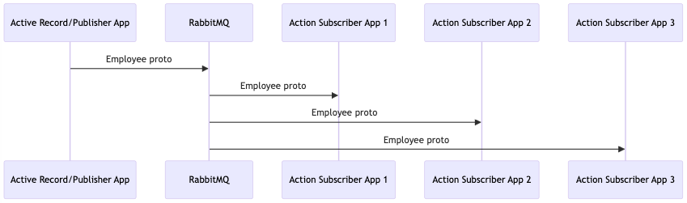

### Chapter 12 - Event Driven Messaging Sandbox

> I'll press your flesh, you dimwitted sumbitch! You don't tell your pappy how to court the electorate. We ain't one-at-a-timin' here. We're MASS communicating! - Pappy O'Daniel, O Brother Where Art Thou?

## Introduction

In chapter 9, we set up a sandbox environment to experiment with sending Protobuf messages over a NATS queue. In this chapter, we'll use Docker and Docker Compose to create an environment and walk through exactly which dependencies we'll need to get a publisher and a consumer up and running. The pub-sub architecture pattern allows us to publish events to 0 or more subscribers, without knowing anything about the individual recipients.

In this sandbox environment, we'll create a publisher and a single subscriber. We're not limited to a single subscriber, as Figure 12-1 illustrates. We'll be using the fire-and-forget pattern to publish a message and all interested parties will be notified.



_**Figure 12-1**_ Fire and forget

For this sandbox environment, we'll create a single publisher and a single subscriber.

## What We'll Need

* RabbitMQ
* Ruby
* Ruby gems
  * Active Publisher
  * Action Subscriber
  * Protobuf
  * Rails
* SQLite

Active Publisher is a gem that makes it easy to configure a RabbitMQ publisher in a Rails app. It depends on the bunny gem we used for testing in chapter 11.

Action Subscriber is another gem we'll use that makes it easy to configure a RabbitMQ consumer in a Rails app. ActionSubscriber also provides a domain specific language (DSL) that makes it easy to define and subscribe to queues on the RabbitMQ server.

We'll use the Protobuf gem to encode and decode our data as described in chapter 8.

## Implementation

### Project Directory Structure

Let's create a directory for our project. We'll need three project sub-directories, one for our shared Protobuf messages, one for our Active Publisher Ruby on Rails application that we'll use to publish messages, and a consumer. You could create multiple consumers to demonstrate that multiple clients can listen for the same events published over the same queue.

In chapter 9, we created a `rails-microservices-sample-code` directory in our home directory. The specific path is not important, but if you've been following along, we can reuse some of the code we generated in chapter 9. Following the tutorial in this chapter, you should end up with the following directories (and many files and directories in each directory).

* rails-microservices-sample-code
  * chapter-12
    * active-publisher
    * action-subscriber
  * protobuf

### Set Up a Development Environment

Some of the steps below are the same as the steps covered in chapter 9. We'll reuse some of the same Dockerfiles which will keep our Ruby versions consistent. I'll include them here, just so we don't have to jump back and forth between chapters. If you followed along in chapter 9 and created these files, you can skip some of these steps.

Let's create a builder Dockerfile and Docker Compose file. We'll use the Dockerfile file to build an image with the command-line apps we need, and we'll use a Docker Compose configuration file to reduce the number of parameters we'll need to use to run each command.

Create the following Dockerfile file in the `rails-microservices-sample-code` directory. We'll use the name `Dockerfile.builder` to differentiate the Dockerfile we'll use to generate new rails services vs the Dockerfile we'll use to build and run our Rails applications.

_**Listing 12-1**_ Dockerfile used to create an image that we'll use to generate our Rails application

```dockerfile
# rails-microservices-sample-code/Dockerfile.builder

FROM ruby:2.6.5

RUN apt-get update && apt-get install -qq -y --no-install-recommends \
    build-essential \
    protobuf-compiler \
    nodejs \
    vim

WORKDIR /home/root

RUN gem install rails -v 5.2.4
RUN gem install protobuf
```

Create the following `docker-compose.builder.yml` file in the `rails-microservices-sample-code` directory. We'll use this configuration file to start our development environment with all of the command-line tools that we'll need.

_**Listing 12-2**_ Docker Compose file to start the container we'll use to generate our Rails application

```yaml
# rails-microservices-sample-code/docker-compose.builder.yml

version: "3.4"

services:
  builder:
    build:
      context: .
      dockerfile: Dockerfile.builder
    volumes:
      - .:/home/root
    stdin_open: true
    tty: true
```

Let's start and log into the builder container. We'll then run the Rails generate commands from the container, which will create two Rails apps. Because we've mapped a volume in the `.yml` file above, the files that are generated will be saved to the `rails-microservices-sample-code` directory. If we didn't map a volume, the files we generate would only exist inside the container, and each time we stop and restart the container they would need to be regenerated. Mapping a volume to a directory on the host computer's will serve files through the container's environment, which includes a specific version of Ruby, Rails and the gems we'll need to run our apps.

_**Listing 12-3**_ Starting our builder container

```console
$ docker-compose -f docker-compose.builder.yml run builder bash
```

The `run` Docker Compose command will build the image (if it wasn't built already), start the container, ssh into the running container and give us a command prompt using the `bash` shell.

You should now see that you're logged in as the root user in the container (you'll see a prompt starting with a hash `#`). Logging in as the root user is usually ok inside a container, because the isolation of the container environment limits what the root user can do.

### Protobuf

Now let's create a Protobuf message and compile the `.proto` file to generate the related Ruby file, containing the classes that will be copied to each of our Ruby on Rails apps. This file will define the Protobuf message, requests and remote procedure call definitions.

Create a couple of directories for our input and output files. The `mkdir -p` command below will create directories with the following structure:

* protobuf
  * definitions
  * lib

_**Listing 12-4**_ Creating needed directories

```console
$ mkdir -p protobuf/{definitions,lib}
```

Our Protobuf definition file:

_**Listing 12-5**_ Employee message protobuf file

```protobuf
# rails-microservices-sample-code/protobuf/definitions/employee_message.proto

syntax = "proto3";

message EmployeeMessage {
  string guid = 1;
  string first_name = 2;
  string last_name = 3;
}

message EmployeeMessageRequest {
  string guid = 1;
  string first_name = 2;
  string last_name = 3;
}

message EmployeeMessageList {
  repeated EmployeeMessage records = 1;
}

# The EmployeeMessageService service was used for ActiveRemote in chapter 9, but is not necessary here. If you have this service already defined, you can leave it here if you wish.

```

To compile the `.proto` files, we'll use a Rake task provided by the `protobuf` gem. To access the `protobuf` gem's Rake tasks, we'll need to create a `Rakefile`. Let's do that now.

_**Listing 12-6**_ Rakefile

```ruby
# rails-microservices-sample-code/protobuf/Rakefile

require "protobuf/tasks"
```

Now we can run the `compile` Rake task to generate the file.

_**Listing 12-7**_ Starting the builder container and compiling the protobuf definition

```console
$ docker-compose -f docker-compose.builder.yml run builder bash
# cd protobuf
# rake protobuf:compile
```

This will generate a file named `employee_message.pb.rb` file in the `protobuf/lib` directory. We'll copy this file into the `app/lib` directory in the Rails apps we'll create next.

### Create a Rails Message Publisher

The first Rails app we'll generate will use the ActivePublisher gem to publish messages to RabbitMQ. We'll add the `active_publisher` gem to the `Gemfile` file. We'll then run the `bundle` command to retrieve the gems from https://rubygems.org. After retrieving the gems, we'll create scaffolding for an Employee entity. This app will store the data in a SQLite database so we can experiment with create and update events.

Let's generate the Rails app that will act as the publisher of the events. We'll call this app `active-publisher`. We'll also add the Protobuf Active Record gem so we can serialize our Active Record object to a Protobuf message.

_**Listing 12-8**_ Generating the Rails apps and necessary files

```console
$ mkdir chapter-12 # create a directory for this chapter
$ docker-compose -f docker-compose.builder.yml run builder bash
# cd chapter-12
# rails new active-publisher
# cd active-publisher
# echo "gem 'active_publisher'" >> Gemfile
# echo "gem 'protobuf-activerecord'" >> Gemfile
# bundle
# rails generate scaffold Employee guid:string first_name:string last_name:string
# rails db:migrate
# exit
```

Be sure to inspect the output of each of the commands above, looking for errors. If errors are encountered, please double-check each command for typos or extra characters.

Let's customize the app to serve our Employee entity via Protobuf. We'll need an `app/lib` directory, and then we'll copy the generated `employee_message.pb.rb` file to this directory.

_**Listing 12-9**_ Setting up the app/lib directory

```console
$ mkdir chapter-12/active-publisher/app/lib
$ cp protobuf/lib/employee_message.pb.rb chapter-12/active-publisher/app/lib/
```

Next, we'll add an `active_publisher` configuration file to the `config` directory. This file will define how our app should connect to the RabbitMQ server. The `rabbit` host will be defined in the `docker-compose` file we'll define in a couple of minutes.

_**Listing 12-10**_ Active Publisher configuration

```yml
# rails-microservices-sample-code/chapter-12/active-publisher/config/active_publisher.yml

default: &default
  host: rabbit
  username: guest
  password: guest

development:
  <<: *default
```

Now let's create an initializer for Active Publisher. This will load the gem, set the adapter, and load the configuration file. Let's create this file in the `config/initializers` directory.

_**Listing 12-11**_ Active Publisher initializer

```ruby
# rails-microservices-sample-code/chapter-12/active-publisher/config/initializers/active_publisher.rb

require "active_publisher"

::ActivePublisher::Configuration.configure_from_yaml_and_cli
```

Next, let's modify the employee model so we can send the employee Profobuf object to RabbitMQ. We'll use Active Record callbacks to publish messages to separate `created` and `updated` queues after an employee record has been created or modified. Open the `app/models/employee.rb` file and add the following code.

_**Listing 12-12**_ Employee Active Record model

```ruby
# rails-microservices-sample-code/chapter-12/active-publisher/app/models/employee.rb

require 'protobuf'

class Employee < ApplicationRecord
  protobuf_message :employee_message

  after_create :publish_created
  after_update :publish_updated

  def publish_created
    Rails.logger.info "Publishing employee object #{self.inspect} on the employee.created queue."
    ::ActivePublisher.publish("employee.created", self.to_proto.encode, "events", {})
  end

  def publish_updated
    Rails.logger.info "Publishing employee object #{self.inspect} on the employee.updated queue."
    ::ActivePublisher.publish("employee.updated", self.to_proto.encode, "events", {})
  end
end
```

Because we're using GUIDs to uniquely identify objects that we're serializing and passing between services, let's modify the controller's `new` action so that it will generate a new GUID.

_**Listing 12-13**_ Employee controller

```ruby
# rails-microservices-sample-code/chapter-12/active-publisher/controllers/employees_controller.rb

def new
  @employee = Employee.new(guid: SecureRandom.uuid)
end
```

We'll also need to add a few more details. Because the `app/lib/employee_message.pb.rb` file contains multiple classes, only the class that matches the file name is loaded. In development mode, Rails can lazy load files as long as the file name can be inferred from the class name, e.g. code requiring the class `EmployeeMessageService` will try to lazy load a file named `employee_message_service.rb`, and throw an error if the file is not found. We can either separate the classes in the `app/lib/employee_message.pb.rb` file into separate files, or enable eager loading in the config. For the purposes of this demo, let's enable eager loading and also cache classes. We'll also need to configure the logger to send output to Docker logs.

_**Listing 12-14**_ Development configuration

```ruby
# rails-microservices-sample-code/chapter-12/active-publisher/config/environments/development.rb

Rails.application.configure do
  ...
  config.cache_classes = true
  ...
  config.eager_load = true
  ...
  logger           = ActiveSupport::Logger.new(STDOUT)
  logger.formatter = config.log_formatter
  config.logger    = ActiveSupport::TaggedLogging.new(logger)
end
```

That's it. Now let's build our subscriber.

### Create a Message Subscriber

Let's create the `action-subscriber` app. It will subscribe to the employee created and updated message queues and simply log that it received a message on the queue.

_**Listing 12-15**_ Generating the Rails apps and necessary files

```console
$ docker-compose -f docker-compose.builder.yml run builder bash
# cd chapter-12
# rails new action-subscriber --skip-active-record
# cd action-subscriber
# echo "gem 'action_subscriber'" >> Gemfile
# echo "gem 'protobuf'" >> Gemfile
# bundle
# exit
```

Now let's set up Action Subscriber to listen for events. We'll need to add a `EmployeeSubscriber` class and add routes via the `ActionSubscriber.draw_routes` method.

We'll want to put our subscriber classes in their own `subscribers` directory. We'll also need the `lib` directory where we'll copy our Employee Protobuf class. Let's create these directories and copy the files to one of those directories:

_**Listing 12-16**_ Generating Rails app directories and copying the message class

```console
$ mkdir chapter-12/action-subscriber/app/{lib,subscribers}
$ cp protobuf/lib/employee_message.pb.rb chapter-12/action-subscriber/app/lib/
```

Now let's add the subscriber class. For the purposes of our playground we'll keep it simple - just log that we received the message.

_**Listing 12-17**_ Employee subscriber class

```ruby
# rails-microservices-sample-code/chapter-12/action-subscriber/app/subscribers/employee_subscriber.rb

class EmployeeSubscriber < ::ActionSubscriber::Base
  def created
    Rails.logger.info "Received created message: #{EmployeeMessage.decode(payload).inspect}"
  end

  def updated
    Rails.logger.info "Received updated message: #{EmployeeMessage.decode(payload).inspect}"
  end
end
```

Our app needs to know which queues to subscribe to, so we use the `default_routes_for` method which will read our `EmployeeSubscriber` class and generate queues for each of our public methods or subscribe to those queues if they already exist. The hostname `host.docker.internal` is a special Docker hostname, it points to the ip address of the host machine.

_**Listing 12-18**_ Action Subscriber initializer

```ruby
# rails-microservices-sample-code/chapter-12/action-subscriber/config/initializers/action_subscriber.rb

ActionSubscriber.draw_routes do
  default_routes_for EmployeeSubscriber
end

ActionSubscriber.configure do |config|
  config.hosts = ["host.docker.internal"]
  config.port = 5672
end
```

We'll need to enable the `cache_classes` and `eager_load` settings, the same way we did for the publisher. We'll also need to set up a logger so that we can see the log output from our Docker container.

_**Listing 12-19**_ Development configuration

```ruby
# rails-microservices-sample-code/chapter-12/action-subscriber/config/environments/development.rb

config.cache_classes = true
...
config.eager_load = true
...
logger           = ActiveSupport::Logger.new(STDOUT)
logger.formatter = config.log_formatter
config.logger    = ActiveSupport::TaggedLogging.new(logger)
```

### Create and Configure Our Environment

Last but not least, let's add a `Dockerfile` and `docker-compose.yml` file to build an image and spin up our Rails and RabbitMQ containers. The `Dockerfile` may already exist from the sandbox we built in chapter 9, but if not, it has the same content here. The `docker-compose.yml` file is new.

_**Listing 12-20**_ Sandbox Dockerfile

```dockerfile
# rails-microservices-sample-code/Dockerfile

FROM ruby:2.6.5

RUN apt-get update && apt-get install -qq -y --no-install-recommends build-essential nodejs

ENV INSTALL_PATH /usr/src/service
ENV HOME=$INSTALL_PATH PATH=$INSTALL_PATH/bin:$PATH
RUN mkdir -p $INSTALL_PATH
WORKDIR $INSTALL_PATH

RUN gem install rails -v 5.2.4

ADD Gemfile* ./
RUN set -ex && bundle install --no-deployment
```

The following Docker Compose file includes an instance of RabbitMQ and our new `active-publisher` and `action-subscriber` Rails apps. We'll expose the web app on port 3001. RabbitMQ can take a few seconds to start, so we'll our `action-subscriber` service to restart if it can't connect. In a real-world application we would want to check the response from RabbitMQ before we started up the subscriber.

Normally, we would add the subscriber to the same Docker Compose file, but, because the Action Subscriber service tries to connect immediately and RabbitMQ can take a few seconds to load, we'll run the subscriber process from a separate Docker Compose file. We'll also need to expose port 5672 to the host machine so we can connect from another Compose environment.

_**Listing 12-21**_ Sandbox Docker Compose file

```yml
# rails-microservices-sample-code/chapter-12/docker-compose.yml
# Usage: docker-compose up

version: "3.4"

services:
  active-publisher:
    build:
      context: ./active-publisher
      dockerfile: ../../Dockerfile
    command: bundle exec puma -C config/puma.rb
    volumes:
    - ./active-publisher:/usr/src/service
    ports:
    - 3001:3000
    depends_on:
    - rabbit
  rabbit:
    image: rabbitmq:latest
    ports:
    - 5672:5672
```

Now let's add the `action-subscriber` configuration file. Note that because the Action Subscriber executable spawns a child process to listen for events from RabbmitMQ, we lose the log output if we start the container using the `up` command. To view all of the log info in the terminal, we'll us the Docker Compose `run` command to start a bash shell and run our `action_subscriber` executable there.

_**Listing 12-22**_ Sandbox Docker Compose subscriber file

```yml
# rails-microservices-sample-code/chapter-12/docker-compose-subscriber.yml
# Usage: docker-compose -f docker-compose-subscriber.yml run action-subscriber bash -c 'bundle exec action_subscriber start'

version: "3.4"

services:
  action-subscriber:
    build:
      context: ./action-subscriber
      dockerfile: ../../Dockerfile
    volumes:
    - ./action-subscriber:/usr/src/service

```

Now that everything's in place, let's start our sandbox environment. Because we may already have a `docker-compose.yml` file in the directory, we named our new config files `docker-compose.yml` and `docker-compose-subscriber.yml`. If we ran the shortest version of the `docker-compose up` command, it would by default look for and load the `docker-compose.yml` file. We can use the `-f` flag to specify that we want to use other configuration files instead. Let's run those commands now.

_**Listing 12-23**_ Starting the sandbox

```console
$ cd chapter-12
$ docker-compose up
```

Once you see lines like this, RabbitMQ has started and the Active Publisher Rails app has successfully connected.

_**Listing 12-24**_ Sandbox logging

```console
rabbit_1            | 2020-02-09 22:54:02.253 [info] <0.8.0> Server startup complete; 0 plugins started.
rabbit_1            |  completed with 0 plugins.
72.30.0.2:5672)
rabbit_1            | 2020-02-09 22:54:37.395 [info] <0.641.0> connection <0.641.0> (172.30.0.1:53140 -> 172.30.0.2:5672): user 'guest' authenticated and granted access to vhost '/'
```

Now let's start the subscriber in another terminal window.

_**Listing 12-25**_ Starting the subscriber sandbox

```console
$ docker-compose -f docker-compose-subscriber.yml run action-subscriber bash -c 'bundle exec action_subscriber start'
```

You should see output like the following.

_**Listing 12-26**_ Subscriber sandbox logging

```console
I, [2020-02-09T22:54:53.900735 #1]  INFO -- : Loading configuration...
I, [2020-02-09T22:54:53.902758 #1]  INFO -- : Requiring app...
I, [2020-02-09T22:54:59.308155 #1]  INFO -- : Starting server...
I, [2020-02-09T22:54:59.374240 #1]  INFO -- : Rabbit Hosts: ["host.docker.internal"]
Rabbit Port: 5672
Threadpool Size: 1
Low Priority Subscriber: false
Decoders:
  --application/json
  --text/plain

I, [2020-02-09T22:54:59.374419 #1]  INFO -- : Middlewares [
I, [2020-02-09T22:54:59.374488 #1]  INFO -- : [ActionSubscriber::Middleware::ErrorHandler, [], nil]
I, [2020-02-09T22:54:59.374542 #1]  INFO -- : [ActionSubscriber::Middleware::Decoder, [], nil]
I, [2020-02-09T22:54:59.374944 #1]  INFO -- : ]
I, [2020-02-09T22:54:59.375946 #1]  INFO -- : EmployeeSubscriber
I, [2020-02-09T22:54:59.376504 #1]  INFO -- :   -- method: created
I, [2020-02-09T22:54:59.376856 #1]  INFO -- :     --  threadpool: default (1 threads)
I, [2020-02-09T22:54:59.378129 #1]  INFO -- :     --    exchange: events
I, [2020-02-09T22:54:59.379231 #1]  INFO -- :     --       queue: actionsubscriber.employee.created
I, [2020-02-09T22:54:59.379911 #1]  INFO -- :     -- routing_key: employee.created
I, [2020-02-09T22:54:59.380686 #1]  INFO -- :     --    prefetch: 2
I, [2020-02-09T22:54:59.382130 #1]  INFO -- :   -- method: updated
I, [2020-02-09T22:54:59.382702 #1]  INFO -- :     --  threadpool: default (1 threads)
I, [2020-02-09T22:54:59.383237 #1]  INFO -- :     --    exchange: events
I, [2020-02-09T22:54:59.383626 #1]  INFO -- :     --       queue: actionsubscriber.employee.updated
I, [2020-02-09T22:54:59.384405 #1]  INFO -- :     -- routing_key: employee.updated
I, [2020-02-09T22:54:59.384667 #1]  INFO -- :     --    prefetch: 2
I, [2020-02-09T22:54:59.393366 #1]  INFO -- : Action Subscriber connected
```

These log lines indicate that the subscriber has connected to the server successfully, connected to two queues and is now listening for events.

Let's create some events. Open your browser and browse to http://localhost:3001/employees. Port 3001 is the port we exposed from the Active Publisher Rails app in the `docker-compose.yml` file. You should see a simple web page with the title **Employees** and a 'New Employee' link. Let's go ahead and click the link. You should now be able to create a new employee record in the web form. Once you fill it out and click the 'Create Employee' button, several things will happen. First, the form data will be sent back to the Active Publisher Rails app. The controller will pass that data on to Active Record, which will create a new record in the SQLite database. Next, the `after_create` callback will run, encoding our Protobuf message and placing it on the `actionsubscriber.employee.created` queue. RabbitMQ will notify subscribers of a specific queue of any new messages. Our Action Subscriber Rails app is one such subscriber. In our `EmployeeSubscriber#created` event handler method, we wrote code to log that we received a message. If you inspect the output from the terminal window where we started the Action Subscriber Rails app, you should see output like the output below.

_**Listing 12-27**_ More subscriber sandbox logging

```console
I, [2020-02-09T23:14:31.163127 #1]  INFO -- : RECEIVED 7a99f6 from actionsubscriber.employee.created
I, [2020-02-09T23:14:31.163758 #1]  INFO -- : START 7a99f6 EmployeeSubscriber#created
Received created message: #<EmployeeMessage guid="8da26c71-b9a2-4219-9499-7d475fc92c6b" first_name="Rocky" last_name="Balboa">
I, [2020-02-09T23:14:31.164414 #1]  INFO -- : FINISHED 7a99f6
```

Congratulations! You have successfully built a messaging platform that can publish and respond to events. Try editing the record you just created. You should see similar output in the Action Subscriber Rails app as it receives and processes the event and the data. For even more fun, try spinning up a second or third subscriber service that listen to the same queues and watch as all of them respond simultaneously to the same published message.

## Resources

* https://docs.docker.com/compose/reference/run
* https://github.com/mxenabled/active_publisher
* https://github.com/ruby-protobuf/protobuf/wiki/Serialization

## Wrap-up

In this chapter, we started a RabbitMQ service, built an Active Publisher Rails application and an Action Subscriber Rails application. We spun those services using two separate Docker environments, and published and consumed messages. We reviewed the logs where we could see that the Protobuf messages were sent successfully from one Rails application to another.

In the next chapter, we're going to combine the two environments to create a platform that can retrieve data from other services as needed. But that's not all! We'll also add event listeners to our services to respond to events from other services.

[Next >>](140-chapter-13.md)
