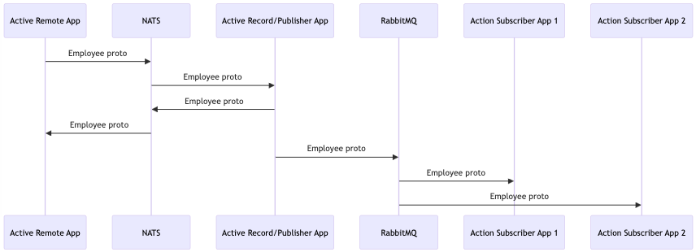

### Chapter 13 - Active Remote with Events Sandbox

## Introduction

So far we've built two Rails services that can communicate with each other via Active Remote and NATS. We've also built two different Rails services that communicate with each via Active Publisher, Action Subscriber and RabbitMQ. As your business requirements grow, you may find the need to use both in your environment - Active Remote for real-time communication between services and Active Subscriber for event-driven messaging.

Lucky for us, we've already laid the groundwork for this type of platform. In this chapter, we'll spin up a new sandbox environment that uses both NATS and RabbitMQ to communicate and publish messages.

_**Figure 13-1**_ Creating an employee and notifying all interested parties



## What We'll Need

* NATS
* RabbitMQ
* Ruby
* Ruby gems
  * Active Publisher
  * Active Remote
  * Action Subscriber
  * Protobuf
  * Rails
* SQLite

## Implementation

### Project Directory Structure

Let's create a directory for our project. We'll need three project sub-directories, one for our shared Protobuf messages, one for our Active Publisher Ruby on Rails application that we'll use to publish messages, and a consumer. You could create multiple consumers to demonstrate that multiple clients can listen for the same events published over the same queue.

In chapter 9, we created a `rails-microservices-sample-code` directory in our home directory. The specific path is not important, but if you've been following along, we can reuse some of the code we generated in chapter 9. Following the tutorial in this chapter, you should end up with the following directories (and many files and directories in each directory).

* rails-microservices-sample-code
  * chapter-13
    * active-record
    * active-remote-publisher
    * action-subscriber
  * protobuf

### Set Up a Development Environment

Some of the steps below are the same as the steps covered in chapters 9 and 12. We'll reuse some of the same Dockerfiles which will keep our Ruby versions consistent. I'll include them here, just so we don't have to jump back and forth between chapters. If you followed along in chapters 9 and 12 and created these files, you can skip some of these steps.

Let's create a builder Dockerfile and Docker Compose file. We'll use the Dockerfile file to build an image with the command-line apps we need, and we'll use a Docker Compose configuration file to reduce the number of parameters we'll need to use to run each command.

Create the following Dockerfile file in the `rails-microservices-sample-code` directory. We'll use the name `Dockerfile.builder` to differentiate the Dockerfile we'll use to generate new rails services vs the Dockerfile we'll use to build and run our Rails applications.

_**Listing 13-2**_ Dockerfile used to create an image that we'll use to generate our Rails application

```dockerfile
# rails-microservices-sample-code/Dockerfile.builder

FROM ruby:2.6.5

RUN apt-get update && apt-get install -qq -y --no-install-recommends \
    build-essential \
    protobuf-compiler \
    nodejs \
    vim

WORKDIR /home/root

RUN gem install rails -v 5.2.4
RUN gem install protobuf
```

Create the following `docker-compose.builder.yml` file in the `rails-microservices-sample-code` directory. We'll use this configuration file to start our development environment with all of the command-line tools that we'll need.

_**Listing 13-3**_ Docker Compose file to start the container we'll use to generate our Rails application

```yaml
# rails-microservices-sample-code/docker-compose.builder.yml

version: "3.4"

services:
  builder:
    build:
      context: .
      dockerfile: Dockerfile.builder
    volumes:
      - .:/home/root
    stdin_open: true
    tty: true
```

Let's start and log into the builder container. We'll then run the Rails generate commands from the container, which will create two Rails apps. Because we've mapped a volume in the `.yml` file above, the files that are generated will be saved to the `rails-microservices-sample-code` directory. If we didn't map a volume, the files we generate would only exist inside the container, and each time we stop and restart the container they would need to be regenerated. Mapping a volume to a directory on the host computer's will serve files through the container's environment, which includes a specific version of Ruby, Rails and the gems we'll need to run our apps.

_**Listing 13-4**_ Starting our builder container

```console
$ docker-compose -f docker-compose.builder.yml run builder bash
```

The `run` Docker Compose command will build the image (if it wasn't built already), start the container, ssh into the running container and give us a command prompt using the `bash` shell.

You should now see that you're logged in as the root user in the container (you'll see a prompt starting with a hash `#`). Logging in as the root user is usually ok inside a container, because the isolation of the container environment limits what the root user can do.

### Protobuf

Now let's create a Protobuf message and compile the `.proto` file to generate the related Ruby file, containing the classes that will be copied to each of our Ruby on Rails apps. This file will define the Protobuf message, requests and remote procedure call definitions.

Create a couple of directories for our input and output files. The `mkdir -p` command below will create directories with the following structure:

* protobuf
  * definitions
  * lib

_**Listing 13-5**_ Creating the necessary directories

```console
$ mkdir -p protobuf/{definitions,lib}
```

Our Protobuf definition file:

_**Listing 13-6**_ Employee message protobuf file

```protobuf
# rails-microservices-sample-code/protobuf/definitions/employee_message.proto

syntax = "proto3";

message EmployeeMessage {
  string guid = 1;
  string first_name = 2;
  string last_name = 3;
}

message EmployeeMessageRequest {
  string guid = 1;
  string first_name = 2;
  string last_name = 3;
}

message EmployeeMessageList {
  repeated EmployeeMessage records = 1;
}

service EmployeeMessageService {
  rpc Search (EmployeeMessageRequest) returns (EmployeeMessageList);
  rpc Create (EmployeeMessage) returns (EmployeeMessage);
  rpc Update (EmployeeMessage) returns (EmployeeMessage);
  rpc Destroy (EmployeeMessage) returns (EmployeeMessage);  
}
```

To compile the `.proto` files, we'll use a Rake task provided by the `protobuf` gem. To access the `protobuf` gem's Rake tasks, we'll need to create a `Rakefile`. Let's do that now.

_**Listing 13-7**_ Rakefile

```ruby
# rails-microservices-sample-code/protobuf/Rakefile

require "protobuf/tasks"
```

Now we can run the `compile` Rake task to generate the file.

_**Listing 13-8**_ Starting the builder container and compiling the protobuf definition

```console
$ docker-compose -f docker-compose.builder.yml run builder bash
# cd protobuf
# rake protobuf:compile
```

This will generate a file named `employee_message.pb.rb` file in the `protobuf/lib` directory. We'll copy this file into the `app/lib` directory in the Rails apps we'll create next.

### Create a Rails App without a Database

We'll call this first app `active-remote`. It will have a model, but the model classes will inherit from `ActiveRemote::Base` instead of the default `ApplicationRecord` (which inherits from `ActiveRecord::Base`). In other words, these models will interact with the `active-remote`'s models by sending messages via the NATS server.

Let's generate the `active-remote` app. We won't need the Active Record persistence layer, so we'll use the `--skip-active-record` flag. We'll need the `active_remote` and `protobuf-nats` gems, but not the `protobuf-activerecord` gem that we included in the `active-record` app. We'll use Rails scaffolding to generate a model, controller and views to view and manage our Employee protobuf that will be shared between our apps.

_**Listing 13-9**_ Generating the Rails apps and necessary files

```console
$ mkdir chapter-13 # create a directory for this chapter
$ docker-compose -f docker-compose.builder.yml run builder bash
# cd chapter-13
# rails new active-remote --skip-active-record
# cd active-remote
# echo "gem 'active_remote'" >> Gemfile
# echo "gem 'protobuf-nats'" >> Gemfile
# bundle
# rails generate scaffold Employee guid:string first_name:string last_name:string
# exit
```

We'll need to make a couple of changes to the `active-remote` app. First, let's copy the Protobuf file.

_**Listing 13-10**_ Setting up the app/lib directory and copying the proto class

```console
$ mkdir chapter-13/active-remote/app/lib
$ cp protobuf/lib/employee_message.pb.rb chapter-13/active-remote/app/lib/
```

Now let's edit the `config/environments/development.rb` file to enable eager loading.

_**Listing 13-11**_ Development configuration

```ruby
# rails-microservices-sample-code/chapter-13/active-remote/config/environments/development.rb

...
config.eager_load = true
...
```

Let's add the `protobuf_nats.yml` file.

_**Listing 13-12**_ Protbuf Nats configuration

```yml
# rails-microservices-sample-code/chapter-13/active-remote/config/protobuf_nats.yml

default: &default
  servers:
    - "nats://nats:4222"

development:
  <<: *default
```

Let's now add a model that inherits from Active Remote.

_**Listing 13-13**_ Employee Active Remote model

```ruby
# rails-microservices-sample-code/chapter-13/active-remote/app/models/employee.rb

class Employee < ActiveRemote::Base
  service_class ::EmployeeMessageService

  attribute :guid
  attribute :first_name
  attribute :last_name
end
```

The last thing we need to do is change a couple of method calls in the `employees_controller.rb` file to change the way that our Protobuf messages are retrieved and instantiated. We need to use the `search` method instead of the default `all` and `find` Active Record methods. Also, because we're using uuids (guids) as the unique key between services, we'll generate a new uuid each time the `new` action is called.

_**Listing 13-14**_ Employee controller

```ruby
# rails-microservices-sample-code/chapter-13/active-remote/controllers/employees_controller.rb

  def index
    @employees = Employee.search({})
  end

  ...

  def new
    @employee = Employee.new(guid: SecureRandom.uuid)
  end

  ...

  def set_employee
    @employee = Employee.search(guid: params[:id]).first
  end
```

### Create a Rails App with a Database

The second Rails app we'll create will have its own database and listen for messages over NATS via Active Remote. It will also use the Active Publisher gem to publish messages to RabbitMQ. We'll add the required gems to the `Gemfile` file. We'll then run the `bundle` command to retrieve the gems from https://rubygems.org. After retrieving the gems, we'll create scaffolding for an Employee entity. This app will store the data in a SQLite database so we can set up the create and update events.

_**Listing 13-15**_ Generating the Rails app and necessary files

```console
$ docker-compose -f docker-compose.builder.yml run builder bash
# cd chapter-13
# rails new active-record-publisher
# cd active-record-publisher
# echo "gem 'active_remote'" >> Gemfile
# echo "gem 'active_publisher'" >> Gemfile
# echo "gem 'protobuf-activerecord'" >> Gemfile
# echo "gem 'protobuf-nats'" >> Gemfile
# bundle
# rails generate scaffold Employee guid:string first_name:string last_name:string
# rails db:migrate
# exit
```

Be sure to inspect the output of each of the commands above, looking for errors. If errors are encountered, please double-check each command for typos or extra characters.

Let's customize the app to serve our Employee entity via Protobuf. We'll need an `app/lib` directory, and then we'll copy the generated `employee_message.pb.rb` file to this directory.

_**Listing 13-16**_ Generating Rails app directories and copying the message class

```console
$ mkdir chapter-13/active-record-publisher/app/lib
$ cp protobuf/lib/employee_message.pb.rb chapter-13/active-record-publisher/app/lib/
```

Next, we'll add an `active_publisher` configuration file to the `config` directory. This file will define how our app should connect to the RabbitMQ server. The `rabbit` host will be defined in the `docker-compose` file we'll define in a couple of minutes.

_**Listing 13-17**_ Active Publisher configuration

```yml
# rails-microservices-sample-code/chapter-13/active-record-publisher/config/active_publisher.yml

default: &default
  host: rabbit
  username: guest
  password: guest

development:
  <<: *default
```

Let's add the `protobuf_nats.yml` file.

_**Listing 13-18**_ Protobuf Nats configuration

```yml
# rails-microservices-sample-code/chapter-13/active-record-publisher/config/protobuf_nats.yml

default: &default
  servers:
    - "nats://nats:4222"

development:
  <<: *default
```

Now let's create an initializer for Active Publisher. This will load the gem, set the adapter, and load the configuration file. Let's create this file in the `config/initializers` directory.

_**Listing 13-19**_ Active Publisher initializer

```ruby
# rails-microservices-sample-code/chapter-13/active-record-publisher/config/initializers/active_publisher.rb

require "active_publisher"

::ActivePublisher::Configuration.configure_from_yaml_and_cli
```

Next, let's modify the employee model so we can send the employee Profobuf object to RabbitMQ. We'll use Active Record callbacks to publish messages to separate `created` and `updated` queues after an employee record has been created or modified. Open the `app/models/employee.rb` file and add the following code.

_**Listing 13-20**_ Employee model

```ruby
# rails-microservices-sample-code/chapter-13/active-record-publisher/app/models/employee.rb

require 'protobuf'

class Employee < ApplicationRecord
  protobuf_message :employee_message

  after_create :publish_created
  after_update :publish_updated

  scope :by_guid, lambda { |*values| where(guid: values) }
  scope :by_first_name, lambda { |*values| where(first_name: values) }
  scope :by_last_name, lambda { |*values| where(last_name: values) }

  field_scope :guid
  field_scope :first_name
  field_scope :last_name

  def publish_created
    Rails.logger.info "Publishing employee object #{self.inspect} on the employee.created queue."
    ::ActivePublisher.publish("employee.created", self.to_proto.encode, "events", {})
  end

  def publish_updated
    Rails.logger.info "Publishing employee object #{self.inspect} on the employee.updated queue."
    ::ActivePublisher.publish("employee.updated", self.to_proto.encode, "events", {})
  end
end
```

### Create a Message Subscriber

Let's create the `action-subscriber` app. It will subscribe to the employee created and updated message queues and simply log that it received a message on the queue.

_**Listing 13-21**_ Starting our builder container

```console
$ docker-compose -f docker-compose.builder.yml run builder bash
# cd chapter-13
# rails new action-subscriber --skip-active-record
# cd action-subscriber
# echo "gem 'action_subscriber'" >> Gemfile
# echo "gem 'protobuf'" >> Gemfile
# bundle
# exit
```

Now let's set up Action Subscriber to listen for events. We'll need to add a `EmployeeSubscriber` class and add routes via the `ActionSubscriber.draw_routes` method.

We'll want to put our subscriber classes in their own `subscribers` directory. We'll also need the `lib` directory where we'll copy our Employee Protobuf class. Let's create these directories and copy the generated `employee_message.pb.rb` file to this directory.

_**Listing 13-22**_ Setting up the app/lib directory

```console
$ mkdir chapter-13/action-subscriber/app/{lib,subscribers}
$ cp protobuf/lib/employee_message.pb.rb chapter-13/action-subscriber/app/lib/
```

We'll need to add a service directory and class to listen for Active Remote messages published via NATS.

_**Listing 13-23**_ Creating the app/services directory

```console
$ mkdir chapter-13/active-record-publisher/app/services
```

_**Listing 13-24**_ Employee message service class

```ruby
# rails-microservices-sample-code/chapter-13/active-record-publisher/app/services/employee_message_service.rb

class EmployeeMessageService
  def search
    records = ::Employee.search_scope(request).map(&:to_proto)

    respond_with records: records
  end

  def create
    record = ::Employee.create(request)

    respond_with record
  end

  def update
    record = ::Employee.where(guid: request.guid).first
    record.assign_attributes(request)
    record.save!

    respond_with record
  end

  def destroy
    record = ::Employee.where(guid: request.guid).first

    record.delete
    respond_with record.to_proto
  end
end
```

Now let's add the subscriber class. For our the purposes of our playground we'll keep it simple - just log that we received the message.

_**Listing 13-25**_ Employee subscriber class

```ruby
# rails-microservices-sample-code/chapter-13/action-subscriber/app/subscribers/employee_subscriber.rb

class EmployeeSubscriber < ::ActionSubscriber::Base
  def created
    Rails.logger.info "Received created message: #{EmployeeMessage.decode(payload).inspect}"
  end

  def updated
    Rails.logger.info "Received updated message: #{EmployeeMessage.decode(payload).inspect}"
  end
end
```

Our app needs to know which queues to subscribe to, so we use the `default_routes_for` method which will read our `EmployeeSubscriber` class and generate queues for each of our public methods or subscribe to those queues if they already exist. The hostname `host.docker.internal` is a special Docker hostname, it points to the ip address of the host machine.

_**Listing 13-26**_ Action Subscriber initializer

```ruby
# rails-microservices-sample-code/chapter-13/action-subscriber/config/initializers/action_subscriber.rb

ActionSubscriber.draw_routes do
  default_routes_for EmployeeSubscriber
end

ActionSubscriber.configure do |config|
  config.hosts = ["host.docker.internal"]
  config.port = 5672
end
```

We'll need to enable the `cache_classes` and `eager_load` settings, the same way we did for the publisher. We'll also need to set up a logger so that we can see the log output from our Docker container.

_**Listing 13-27**_ Development configuration

```ruby
# rails-microservices-sample-code/chapter-13/action-subscriber/config/environments/development.rb

config.cache_classes = true
...
config.eager_load = true
...
logger           = ActiveSupport::Logger.new(STDOUT)
logger.formatter = config.log_formatter
config.logger    = ActiveSupport::TaggedLogging.new(logger)
```

### Create and Configure Our Environment

Last but not least, let's add a `Dockerfile` and two Compose files: `docker-compose.yml` and `docker-compose-subscriber.yml`. These files will be used to build an image and spin up our Rails, NATS and RabbitMQ containers. The `Dockerfile` may already exist from the sandbox we built in chapters 9 and 12, but if not, it has the same content here.

_**Listing 13-28**_ Sandbox Dockerfile

```dockerfile
# rails-microservices-sample-code/Dockerfile

FROM ruby:2.6.5

RUN apt-get update && apt-get install -qq -y --no-install-recommends build-essential nodejs

ENV INSTALL_PATH /usr/src/service
ENV HOME=$INSTALL_PATH PATH=$INSTALL_PATH/bin:$PATH
RUN mkdir -p $INSTALL_PATH
WORKDIR $INSTALL_PATH

RUN gem install rails -v 5.2.4

ADD Gemfile* ./
RUN set -ex && bundle install --no-deployment
```

The following Docker Compose file includes an instance of RabbitMQ and our new `active-record-publisher` and `active-remote` Rails apps. We'll expose the `active-remote` web app on port 3002.

Normally, we would add the subscriber to the same Docker Compose file, but, because the Action Subscriber service tries to connect immediately and RabbitMQ can take a few seconds to load, we'll run the subscriber process from a separate Docker Compose file. We'll also need to expose port 5672 to the host machine so we can connect from the other Compose environment.

_**Listing 13-29**_ Sandbox Docker Compose file

```yml
# rails-microservices-sample-code/chapter-13/docker-compose.yml
# Usage: docker-compose up

version: "3.4"

services:
  active-record-publisher:
    environment:
    - PB_SERVER_TYPE=protobuf/nats/runner
    build:
      context: ./active-record-publisher
      dockerfile: ../../Dockerfile
    command: bundle exec rpc_server start -p 9399 -o active-record-publisher ./config/environment.rb
    volumes:
    - ./active-record-publisher:/usr/src/service
    depends_on:
    - nats
    - rabbit
  active-remote:
    environment:
    - PB_CLIENT_TYPE=protobuf/nats/client
    build:
      context: ./active-remote
      dockerfile: ../../Dockerfile
    command: bundle exec puma -C config/puma.rb
    ports:
    - 3002:3000
    volumes:
    - ./active-remote:/usr/src/service
    depends_on:
    - nats
  rabbit:
    image: rabbitmq:latest
    ports:
    - 5672:5672
  nats:
    image: nats:latest
```

Now let's add the `action-subscriber` configuration file. Note that because the Action Subscriber executable spawns a child process to listen for events from RabbmitMQ, we lose the log output if we start the container using the `up` command. To view all of the log info in the terminal, we'll us the Docker Compose `run` command to start a bash shell and run our `action_subscriber` executable there.

_**Listing 13-30**_ Sandbox Docker Compose subscriber file

```yml
# rails-microservices-sample-code/chapter-13/docker-compose-subscriber.yml
# Usage: docker-compose -f docker-compose-subscriber.yml run action-subscriber bash -c 'bundle exec action_subscriber start'

version: "3.4"

services:
  action-subscriber:
    build:
      context: ./action-subscriber
      dockerfile: ../../Dockerfile
    volumes:
    - ./action-subscriber:/usr/src/service
```

Now that everything's in place, let's start our active-remote and active-record-publisher apps. 

_**Listing 13-31**_ Starting the sandbox

```console
$ cd chapter-13
$ docker-compose up
```

Once you see lines like this, RabbitMQ has started and the Active Publisher Rails app has successfully connected.

_**Listing 13-32**_ Sandbox logging

```console
rabbit_1            | 2020-02-09 22:54:02.253 [info] <0.8.0> Server startup complete; 0 plugins started.
rabbit_1            |  completed with 0 plugins.
72.30.0.2:5672)
rabbit_1            | 2020-02-09 22:54:37.395 [info] <0.641.0> connection <0.641.0> (172.30.0.1:53140 -> 172.30.0.2:5672): user 'guest' authenticated and granted access to vhost '/'
```

Now let's start the subscriber in another terminal window. We can use the `-f` flag to specify that we want to use the `docker-compose-subscriber.yml` file. Let's run this command now.

_**Listing 13-33**_ Starting the subscriber sandbox

```console
$ docker-compose -f docker-compose-subscriber.yml run action-subscriber bash -c 'bundle exec action_subscriber start'
```

You should see output like the following.

_**Listing 13-34**_ Subscriber sandbox logging

```console
I, [2020-03-09T02:54:50.619645 #1]  INFO -- : Starting server...
I, [2020-03-09T02:54:50.667362 #1]  INFO -- : Rabbit Hosts: ["host.docker.internal"]
Rabbit Port: 5672
Threadpool Size: 8
Low Priority Subscriber: false
Decoders:
  --application/json
  --text/plain

I, [2020-03-09T02:54:50.667541 #1]  INFO -- : Middlewares [
I, [2020-03-09T02:54:50.667632 #1]  INFO -- : [ActionSubscriber::Middleware::ErrorHandler, [], nil]
I, [2020-03-09T02:54:50.667665 #1]  INFO -- : [ActionSubscriber::Middleware::Decoder, [], nil]
I, [2020-03-09T02:54:50.667681 #1]  INFO -- : ]
I, [2020-03-09T02:54:50.667708 #1]  INFO -- : EmployeeSubscriber
I, [2020-03-09T02:54:50.667766 #1]  INFO -- :   -- method: created
I, [2020-03-09T02:54:50.667818 #1]  INFO -- :     --  threadpool: default (8 threads)
I, [2020-03-09T02:54:50.667872 #1]  INFO -- :     --    exchange: events
I, [2020-03-09T02:54:50.668058 #1]  INFO -- :     --       queue: actionsubscriber.employee.created
I, [2020-03-09T02:54:50.668253 #1]  INFO -- :     -- routing_key: employee.created
I, [2020-03-09T02:54:50.668350 #1]  INFO -- :     --    prefetch: 2
I, [2020-03-09T02:54:50.668401 #1]  INFO -- :   -- method: updated
I, [2020-03-09T02:54:50.668603 #1]  INFO -- :     --  threadpool: default (8 threads)
I, [2020-03-09T02:54:50.668649 #1]  INFO -- :     --    exchange: events
I, [2020-03-09T02:54:50.668682 #1]  INFO -- :     --       queue: actionsubscriber.employee.updated
I, [2020-03-09T02:54:50.668711 #1]  INFO -- :     -- routing_key: employee.updated
I, [2020-03-09T02:54:50.668737 #1]  INFO -- :     --    prefetch: 2
I, [2020-03-09T02:54:50.674268 #1]  INFO -- : Action Subscriber connected
```

These log lines indicate that the subscriber has connected to the server successfully, connected to two queues and is now listening for events.

Let's create an event. Open your browser and browse to http://localhost:3002/employees. Port 3002 is the port we exposed from the `active-remote` Rails app in the `docker-compose.yml` file. You should see a simple web page with the title **Employees** and a 'New Employee' link. Let's go ahead and click the link. You should now be able to create a new employee record in the web form. Once you fill it out and click the 'Create Employee' button, several things will happen. First, the form data will be sent back to the `active-remote` Rails app. The controller will pass that data on to the Active Remote Employee model, which will send the data via NATS to our `active-record-publisher` Rails app. The `active-record-publisher` app will create a new record in the SQLite database. In the `active-record-publisher` model, the `after_create` callback will run, encoding our Protobuf message and placing it on the `actionsubscriber.employee.created` queue. RabbitMQ will notify all subscribers listening on a specific queue of any new messages. Our `action-subscriber` Rails app is one such subscriber. In our `EmployeeSubscriber#created` event handler method, we wrote code to log that we received a message. If you inspect the output from the terminal window where we started the `action-subscriber` Rails app, you should see logging info similar to the output below.

_**Listing 13-35**_ More subscriber sandbox logging

```console
I, [2020-03-09T03:03:05.876609 #1]  INFO -- : RECEIVED 35f733 from actionsubscriber.employee.created
I, [2020-03-09T03:03:05.877003 #1]  INFO -- : START 35f733 EmployeeSubscriber#created
Received created message: #<EmployeeMessage guid="df3ec377-21be-4b29-84de-a4fba0306274" first_name="Adrian" last_name="Pennino">
I, [2020-03-09T03:03:05.877295 #1]  INFO -- : FINISHED 35f733
```

Congratulations! You have successfully built a messaging platform that can publish messages via Active Remote and apps that can respond to events. Try editing the record you just created. You should see similar output in the Action Subscriber Rails app as it receives and processes the event and the data. For even more fun, try spinning up a second or third subscriber service that listen to the same queues and watch as all of them respond simultaneously to the same published message.

## Resources

* https://github.com/kevinwatson/rails-microservices-sample-code

## Wrap-up

In this chapter, we have built three Rails applications that share data using patterns that provide both real-time and event-driven communications. Each pattern has its place. Sometimes communication needs to be real-time, such as when a microservice needs access to one or more records. Other times, requests between services doesn't need to be real-time, but event-driven, such as when a service needs to be notified and a long-running process needs to be started, but the caller doesn't need to know when the process has finished. Examining your business requirements can help you determine when each is necessary.

This chapter wraps up our journey of building microservices using Ruby on Rails. We've covered a lot of ground. In our next and final chapter, we'll summarize what we've learned so far. We'll also discuss a few ways to continue our journey.

[Next >>](150-chapter-14.md)
